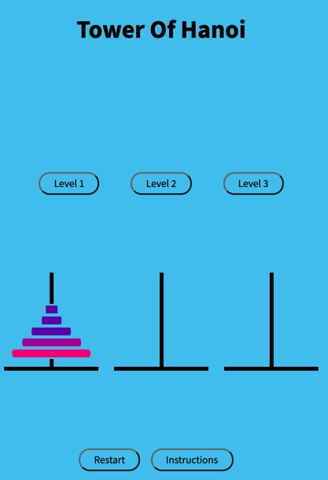
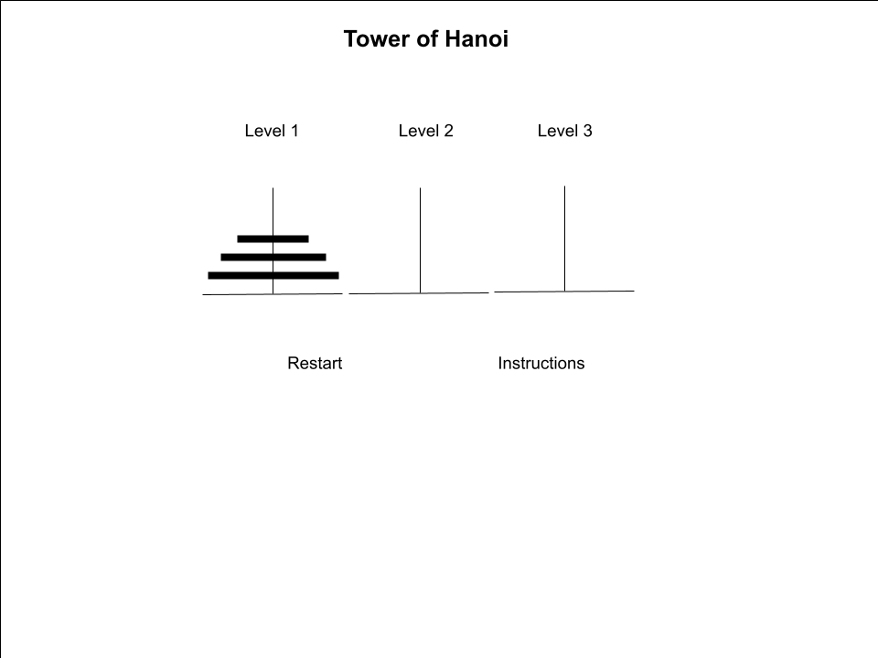

# Tower-of-Hanoi

##  Description

Welcome to my first project on GitHub! This project was a part of the Software Engineering Immersive program at General Assembly. It is a browser based game of the Tower of Hanoi.

Tower of Hanoi consists of three towers and a number of different sized disks. The disks are placed on the left most ring from largest to smallest. the goal of the game is to get all the disks to the right most ring. Only one disk can be moved at a time. no disk may be placed on top of another disk if the other disk is smaller. Only the top most ring on a disk can be moved.

## Technologies Used

- HTML
- CSS
- Javascript

## Screenshot of the Application

## Installation Instructions

To play in a browser, go to: https://mbrockus.github.io/Tower-of-Hanoi/
<!-- 
To install locally:

- fork and clone this repository -->

##  User Stories

### MVP

- [x] As a user, I want to be able to see where the rings and disks are, so I can see how the game is going.
- [x] As a user, I want to be able to drag a disk and drop it onto a new ring, so I can progress with the game.
- [x] As a user, I want the game to prevent me from making an illegal move, so I can play the game fairly.
- [x] As a user, I want to be able to reset the game, so I can start over if I get lost.
- [x] As a user, I want to know when I win the game, so I can get a positive experience when winning.

### Stretch goals
- [x] As a user, I want to play more challenging levels, so I can experience a challenge
- [x] As a user, I want to know how many moves I have made, so I can gauge how well I am doing
- [ ] As a user, I want to see a global scoreboard, so I can see how well I am doing vs others
- [ ] As a user, I want to be able to drag an drop the disks, for a more intuitive experience
- [ ] As a user, I want to see how few moves I could have made, so I know how much room I have to grow.

##  Wireframe

## Debugging in progress

- Uncaught DOMException error when a tower is clicked on the same selected disk it contains
