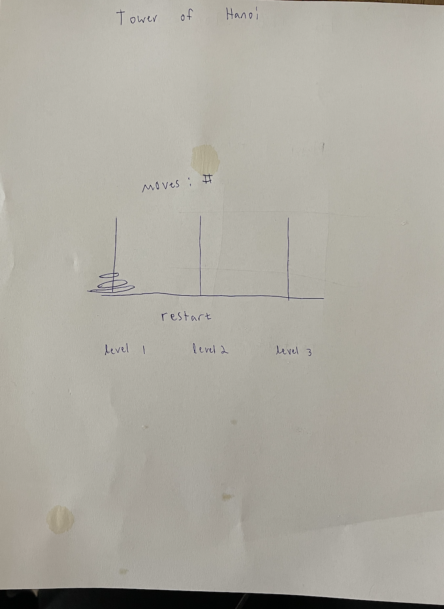

# Tower-of-Hanoi

##  Description

Tower of Hanoi is a browser game written in HTML, CSS, and JavaScript. it consists of three towers and a number of different sized disks. The disks are placed on the left most ring from largest to smallest. the goal of the game is to get all the disks to the right most ring. Only one disk can be moved at a time. no disk may be placed on top of another disk if the other disk is smaller. Only the top most ring on a disk can be moved.

## Screenshot of the Application

## Installation Instructions

Go to https://mbrockus.github.io/Tower-of-Hanoi/

##  User Stories

### MVP
- As a user, I want to be able to see where the rings and disks are, so I can see how the game is going.
- As a user, I want to be able to drag a disk and drop it onto a new ring, so I can progress with the game.
- As a user, I want the game to prevent me from making an illegal move, so I can play the game fairly.
- As a user, I want to be able to reset the game, so I can start over if I get lost.
- As a user, I want to know when I win the game, so I can get a positive experience when winning.

### Stretch goals
- As a user, I want to play more challenging levels, so I can experience a challenge
- As a user, I want to know how many moves I have made, so I can gauge how well I am doing
- As a user, I want a limit on how many moves I can make, so I can have a challenge
- As a user, I want to see a global scoreboard, so I can see how well I am doing vs others

##  Wireframe

